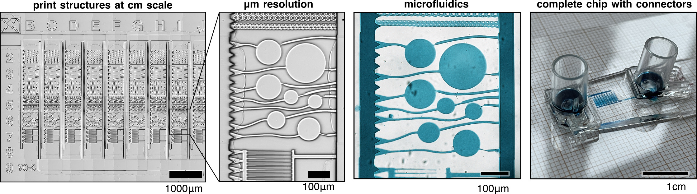
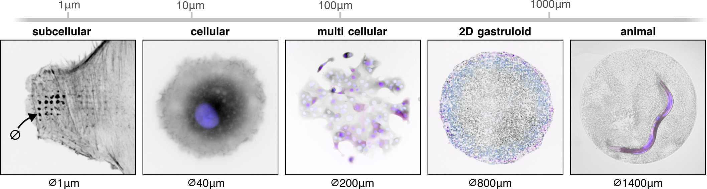
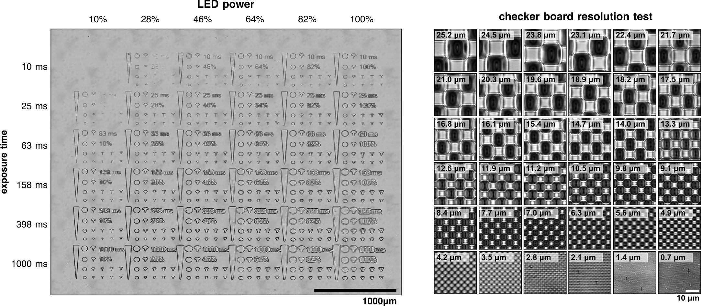
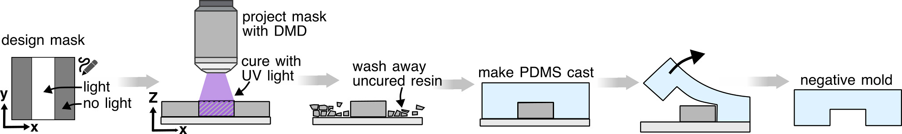

# fabscope
## Use your microscope for microfabrication!
Microscope with DMD projector is used to cure 3D printing resin. Based on uManager so [many hardware devices are compatible](https://micro-manager.org/Device_Support).
Using the X/Y stage of the microscope, large structures can be printed while maintaining high spatial resolution.
`fabscope_notebook.py` offers step-by-step instructions to set up and calibrate the hardware, and a simple-to-use GUI in napari for checking the focus and aligning mutiple layers.

----
### Example of a microfluidic chip:

----
### We use it in cell biological research for a wide range of experiments. Examples from sub-cellular to animal scales:

----
### Single-step exposure calibration and resolution tests

----
### Overview of the workflow:

----

